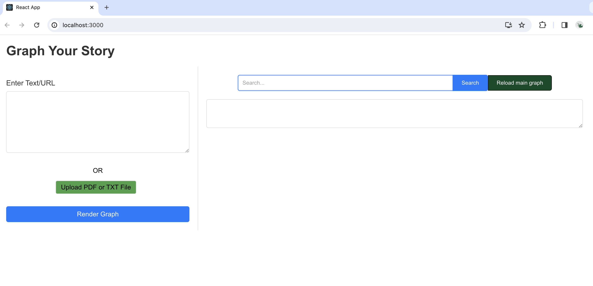
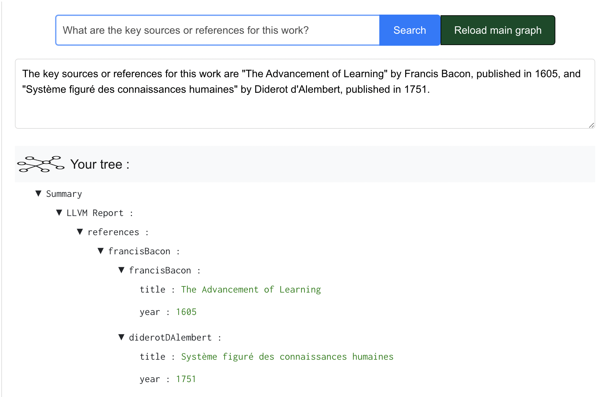

# Text2Graph

Work by Adithya Iyer (adithyaiyer1999@gmail.com), Srushti Pawar (srushtipawar12@gmail.com) and Alex Kaiser (amjkaiser@gmail.com). Advised by Prof Saining Xie at NYU (https://www.sainingxie.com/)

We are currently in beta, you can try out our app here : https://text2knowledgegraph.netlify.app/

For Beta Feedback, fill : https://forms.gle/evQCM7AYSLikM8baA

Welcome to text2Graph, our tool to convert text into a graph or tree format using large language models. You can create graphs by uploading .txt files, .pdf files or even youtube links!

In additional functionality, you can also edit a graph you created, and use LLMs to search and traverse the graph!

## This contains both the react repository and the django repo

To get both of them running locally, follow the steps below. There are individual ReadMe's in both the folders to assist.

### First, run the django repo

1. Go inside django directory, run `cd text2Json_django`.
2. Add your openAi key to the terminal, run `export OPENAI_API_KEY=sk-your-openai-key`.
3. Install dependencies via `pip install -r ./text2Json_django/requirements.txt`
4. Update `BASE_URL` in `./text2graph_react/src/App.js` to your local port/url.
5. Run `python manage.py runserver`

The POST requests should be running now

### Get the website running in react - just do

1. Go inside react directory, run `cd text2graph_react`.
3. Run `npm start`

This will successfully start the application.

## License
This project is licensed under the MIT License - see the [LICENSE](LICENSE) file for details.