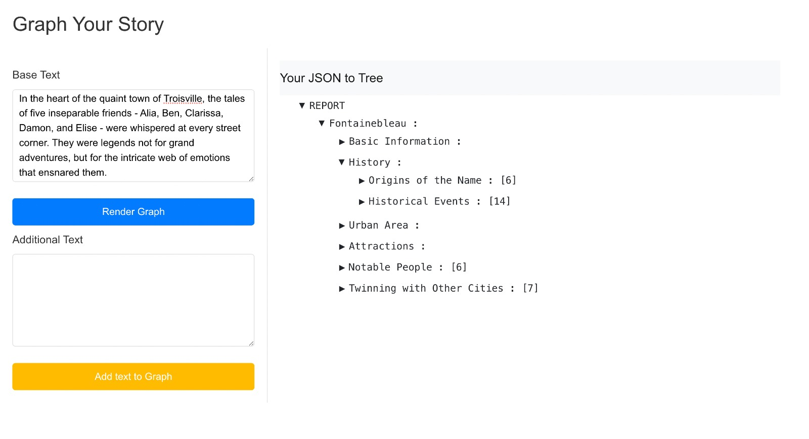

# Text2Graph

Welcome to text2Graph, our tool to convert text into a graph or tree format using large language models.




## This contains both the react repository and the django repo

To get both of them running, follow the steps below. There are individual ReadMe's in both the folders to assist.

### First, run the django repo

1. Add your openAi key to the terminal, run `OPENAI_API_KEY=sk-your-openai-key`.
2. Run `python manage.py runserver`

The POST requests should be running now

### Get the website running in react - just do

```
 npm start
```

